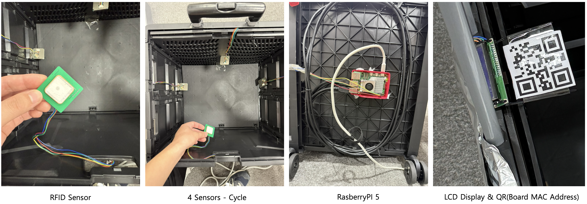
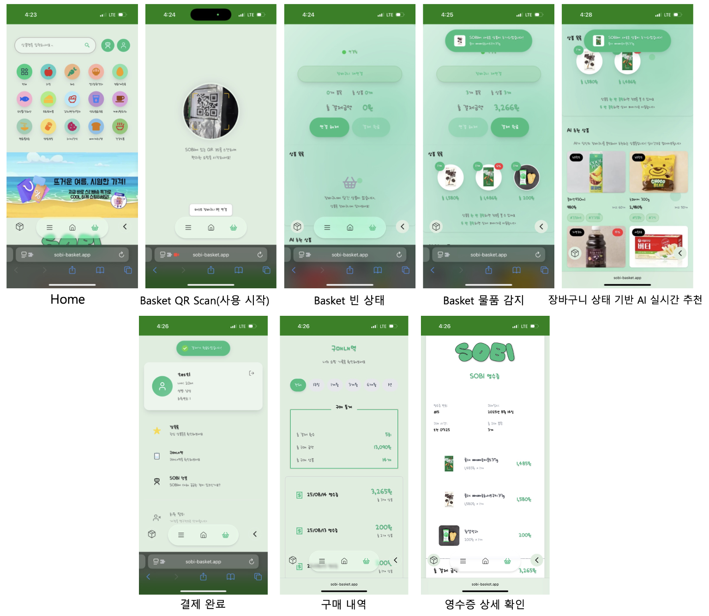
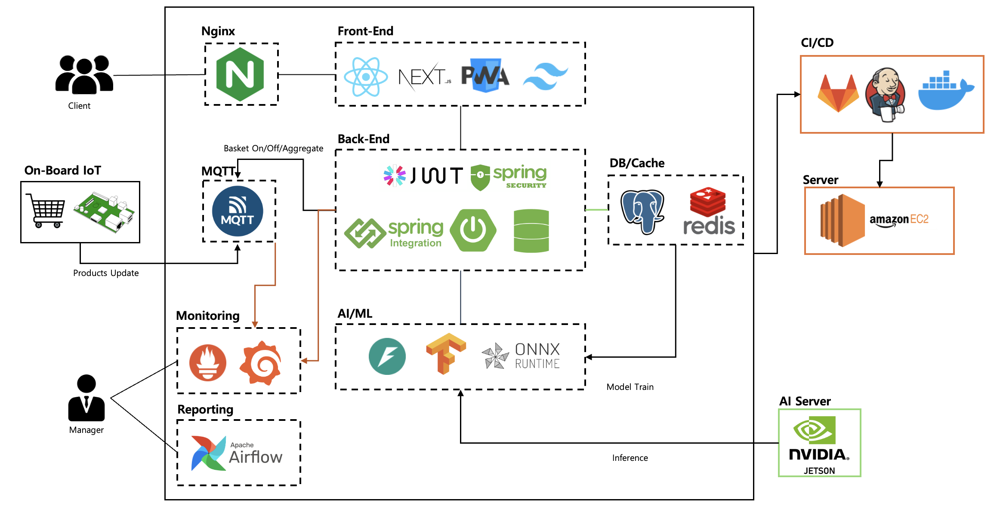

# AIoT 스마트 바스켓 🛒

**RFID 기술과 AI를 결합한 차세대 스마트 쇼핑 솔루션**

장바구니/카트에 부착된 AIoT 디바이스를 통해 실시간 가격 합산, 개인화 상품 추천, 셀프 결제를 제공하는 AIoT 리테일 시스템입니다.

### 🖥️ 웹 애플리케이션


- **메인 서비스**: https://sobi-basket.app
- **모바일 PWA**: 위 링크에서 "홈 화면에 추가" 가능

### 📚 API 문서 및 개발자 도구
- **서버 환경**: AWS EC2 (13.125.215.242)
- **REST API 베이스**: https://sobi-basket.app/api
- **Swagger API 문서**: http://13.125.215.242:8080/swagger-ui/index.html
- **Grafana 대시보드**: http://13.125.215.242:3001

## 목차

- [주요 기능](#주요-기능)
- [시스템 아키텍처](#시스템-아키텍처)
- [프로젝트 구조](#프로젝트-구조)
- [빠른 시작](#빠른-시작)
- [기술 스택](#기술-스택)
- [시스템 워크플로우](#시스템-워크플로우)
- [테스트](#테스트)

## 주요 기능

### 🏷️ 실시간 RFID 인식

<div style="display: flex; justify-content: space-between;">
    
  </div>

- YRM1001 RFID 리더를 통한 자동 상품 태그 인식
- RSSI 기반 정밀 위치 감지로 오인식 방지
- 다중 센서 폴링으로 안정적인 상품 추가/제거 감지
- MQTT 기반 IoT 디바이스 제어

### 📱 실시간 사용자 경험

<div style="display: flex; justify-content: space-between;">
    
  </div>

- PWA 지원으로 네이티브 앱 경험
- Server-Sent Events (SSE)로 실시간 바구니 상태 동기화
- 실시간 장바구니 컨텍스트 기반 추천
  - **비회원**: TF-IDF + SessionKNN 하이브리드 모델
  - **회원**: Two-Tower 딥러닝 모델 (ONNX 최적화)
- 모바일 웹앱을 통한 셀프 결제
- 실시간 가격 합산 및 할인 적용

## 시스템 아키텍처

  <div style="display: flex; justify-content: space-between;">
    
  </div>

    Data Flow:
    RFID Tags → Raspberry Pi → MQTT → Spring Boot → Database/Cache → SSE → Web App
    User Actions → Web App → Spring API → AI Service → Recommendations → Web App


## 프로젝트 구조

```
S13P11B103/
├── frontend/sobi-front/          # Next.js 15 + React 19 웹앱
│   ├── app/                         # App Router (Next.js 13+)
│   ├── components/                  # 재사용 가능한 컴포넌트
│   ├── utils/hooks/                 # 커스텀 React 훅
│   └── types/                       # TypeScript 타입 정의
│
├── backend/sobi_backend/         # Spring Boot 3.5.3 API 서버
│   ├── src/main/java/com/sobi/      # 메인 애플리케이션 코드
│   │   ├── controller/              # REST API 컨트롤러
│   │   ├── service/                 # 비즈니스 로직 서비스
│   │   ├── entity/                  # JPA 엔티티
│   │   ├── repository/              # 데이터 액세스 레이어
│   │   └── config/                  # 설정 클래스 (MQTT, Security 등)
│   └── src/test/                    # JUnit 테스트
│
├── ai/                           # AI/ML 마이크로서비스
│   ├── recommend/                   # 상품 추천 API (FastAPI)
│   │   ├── app/models/              # 추천 모델 (guest/member)
│   │   ├── train/                   # 모델 학습 스크립트
│   │   └── parameters/              # 학습된 모델 아티팩트
│   └── weekly_report/               # 비즈니스 분석 리포트
│
├── embedded/                     # IoT/임베디드 시스템
│   ├── rfid_minimal/                # RFID 리더 제어 모듈
│   │   ├── managers/                # 센서 및 카트 관리자
│   │   ├── sensors/                 # 하드웨어 추상화 레이어
│   │   └── protocols/               # 통신 프로토콜 핸들러
│   ├── mqtt/                        # MQTT 발행/구독 모듈
│   └── mqtt_controller.py           # 메인 MQTT 컨트롤러
│
├── docker-compose.*.yaml         # Docker Compose 설정
├── nginx/                        
├── monitoring/                   # Prometheus + Grafana 설정
├── airflow/                      # 자동화 Task
└── sql/                          # 데이터베이스 초기화 스크립트
```

## 빠른 시작

### 전체 시스템 실행 (Docker Compose)

```bash
# 1. 저장소 클론
git clone https://lab.ssafy.com/s13-webmobile3-sub1/S13P11B103.git
cd S13P11B103

# 2. 환경 변수 설정
cp .env.example .env
# .env 파일을 환경에 맞게 수정

# 3. 코어 인프라 실행 (DB, Redis, MQTT)
docker compose -f docker-compose.core.yaml up -d

# 4. 웹 애플리케이션 실행 (Frontend + Backend)
docker compose -f docker-compose.web.yaml up -d

# 5. AI/ML 서비스 실행
docker compose -f docker-compose.mlops.yaml up -d

# 6. 모니터링 스택 실행
docker compose -f docker-compose.monitoring.yaml up -d
```

### 개별 서비스 실행

#### Backend (Spring Boot)
```bash
cd backend/sobi_backend
./gradlew bootRun
# 로컬 서버: http://localhost:8080
# 프로덕션: https://sobi-basket.app/api
# API 문서: https://sobi-basket.app/swagger-ui.html
```

#### Frontend (Next.js)
```bash
cd frontend/sobi-front
npm install
npm run dev
# 로컬: http://localhost:3001
# 프로덕션: https://sobi-basket.app
```

#### AI 추천 서비스
```bash
cd ai/recommend
pip install -r requirements.txt
python -m app.main
# 추천 API: http://localhost:8000
```

#### IoT 컨트롤러
```bash
cd embedded
python mqtt_controller.py
# MQTT 토픽을 통한 RFID 시스템 제어
```

## 기술 스택

### IoT/Embedded (Hardware Integration)
| 기술 | 버전 | 용도 |
|------|------|------|
| Python | 3.9+ | 임베디드 제어 로직 |
| Paho MQTT | 1.6+ | 메시지 브로커 통신 |
| YRM1001 SDK | 2023 | RFID 리더 제어 |
| RPi.GPIO | 0.7+ | Raspberry Pi GPIO 제어 |

### Backend (Spring Ecosystem)
| 기술 | 버전 | 용도 |
|------|------|------|
| Spring Boot | 3.5.3 | 메인 프레임워크 |
| Spring Security | 6.x | JWT 인증/인가 |
| Spring Data JPA | 3.x | ORM 및 데이터 액세스 |
| Spring Integration | 6.x | MQTT 메시징 |
| PostgreSQL | 15 | 메인 데이터베이스 |
| Redis | 7 | 세션 저장소 및 캐시 |
| Eclipse Paho MQTT | 1.2.5 | IoT 디바이스 통신 |

### Frontend (Modern Web Stack)
| 기술 | 버전 | 용도 |
|------|------|------|
| Next.js | 15 | React 메타프레임워크 |
| React | 19 | UI 라이브러리 |
| TypeScript | 5.x | 정적 타입 시스템 |
| TailwindCSS | 4.x | 유틸리티-퍼스트 CSS |
| Zustand | 5.x | 경량 상태 관리 |
| React Query | 5.x | 서버 상태 관리 |
| Next PWA | 5.x | 프로그레시브 웹앱 |

### AI/ML (Python Ecosystem)
| 기술 | 버전 | 용도 |
|------|------|------|
| FastAPI | 0.116+ | ML API 서버 |
| scikit-learn | 1.7+ | 머신러닝 (TF-IDF, KNN) |
| TensorFlow | 2.x | 딥러닝 (Two-Tower 모델) |
| ONNX Runtime | 1.22+ | 모델 추론 최적화 |
| Prophet | 1.1+ | 시계열 예측 |
| LightGBM | 4.6+ | 그래디언트 부스팅 |

### Infrastructure (DevOps & Monitoring)
| 기술 | 버전 | 용도 |
|------|------|------|
| Docker | 20.10+ | 컨테이너화 |
| Docker Compose | 2.x | 멀티 컨테이너 관리 |
| Nginx | 1.25+ | 리버스 프록시 |
| Jenkins | 2.x | CI/CD 파이프라인 |
| Airflow | 2.x | MLOps 워크플로우 |
| Prometheus | 2.x | 메트릭 수집 |
| Grafana | 10.x | 모니터링 대시보드 |

## 시스템 워크플로우

### 🛒 사용자 쇼핑 시나리오

#### 1. 쇼핑 시작
```
고객 도착 → QR 코드 스캔 → 웹앱 접속 → 로그인/게스트 선택 → 바구니 선택 → MQTT "start" 신호 → LCD 활성화
```

#### 2. 상품 담기
```
상품 선택 → RFID 태그 바구니 근접 → 센서 감지 → 실시간 가격 합산 → 웹앱 바구니 업데이트 → AI 추천 표시
```

#### 3. 쇼핑 중 상호작용
```
추천 상품 확인 → 상품 위치 검색 → 상품 상세정보 조회 → 찜 목록 추가 → 할인 혜택 확인
```

#### 4. 결제 및 종료
```
쇼핑 완료 → 총액 확인 → 모바일 결제 → 영수증 생성 → 바구니 반납 → MQTT "end" 신호 → 시스템 초기화
```

### ⚙️ 기술적 통신 플로우

#### 1. RFID 상품 감지 플로우
```
RFID Tag → YRM1001 Reader → Raspberry Pi → MQTT Broker → Spring Backend → PostgreSQL/Redis → SSE → Web Client
```

#### 2. 실시간 바구니 동기화
```
IoT Device (Cart State) → MQTT (basket/{id}/update) → Backend (MQTT Handler) → Redis Cache → SSE Broadcast → Frontend (Real-time Update)
```

#### 3. AI 추천 플로우
```
User Action → Backend API → FastAPI ML Service → Recommendation Model → Cached Results → Frontend Display
```

#### 4. 인증 및 세션 관리
```
Login Request → JWT Token Generation → Redis Session Storage → Protected API Access → Token Validation
```

## 테스트

### MQTT
```bash
# MQTT 발행 테스트
mosquitto_pub -h localhost -t "basket/1/status" -m "start"

# MQTT 구독 테스트
mosquitto_sub -h localhost -t "basket/+/update"

# MQTT 연결 문제 해결
docker compose ps sobi-mqtt  # 브로커 상태 확인
cat embedded/mqtt/config.py  # 설정 확인
netstat -an | grep 1883      # 포트 사용 확인
```

### API
```bash
# 프로덕션 Swagger UI에서 테스트
open https://sobi-basket.app/swagger-ui.html

# cURL을 통한 API 테스트 (프로덕션)
curl -X POST https://sobi-basket.app/api/auth/login \
  -H "Content-Type: application/json" \
  -d '{"email":"test@example.com","password":"password"}'

# 로컬 개발 환경
curl -X POST http://localhost:8080/api/auth/login \
  -H "Content-Type: application/json" \
  -d '{"email":"test@example.com","password":"password"}'
```

### SSE 관련 연결 확인
```bash
# Redis 연결 상태 확인
redis-cli ping

# 사용자-바구니 매핑 확인
redis-cli get "user_basket:1"

# 백엔드 SSE 로그 확인
docker compose logs sobi-backend | grep SSE
```

### 데이터베이스 연결 확인
```bash
# PostgreSQL 상태 확인
docker compose ps sobi-db

# 데이터베이스 연결 테스트
psql -h localhost -U sobi_user -d sobi_db

# 마이그레이션 스크립트 재실행
docker compose exec sobi-db psql -U sobi_user -d sobi_db -f /docker-entrypoint-initdb.d/01_init.sql
```

### AI 모델 추론 확인
```bash
# AI 서비스 로그 확인
docker compose logs ai-recommend

# 모델 파일 존재 확인
ls ai/recommend/parameters/guest_model/
ls ai/recommend/parameters/member_model/

# Python 의존성 확인
pip list | grep -E "(tensorflow|scikit-learn|onnxruntime)"
```

---

<div align="center">
  
  **AIoT Smart Basket** - Revolutionizing Retail Shopping Experience

</div>