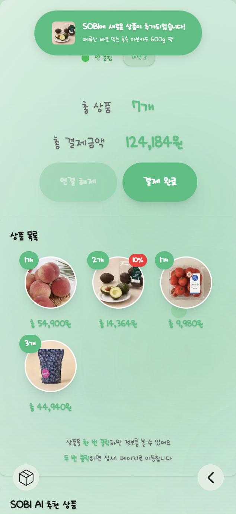
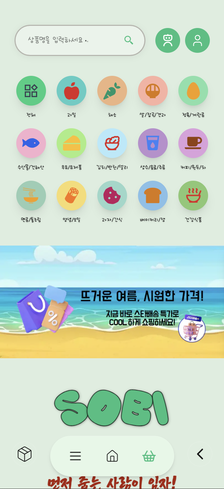
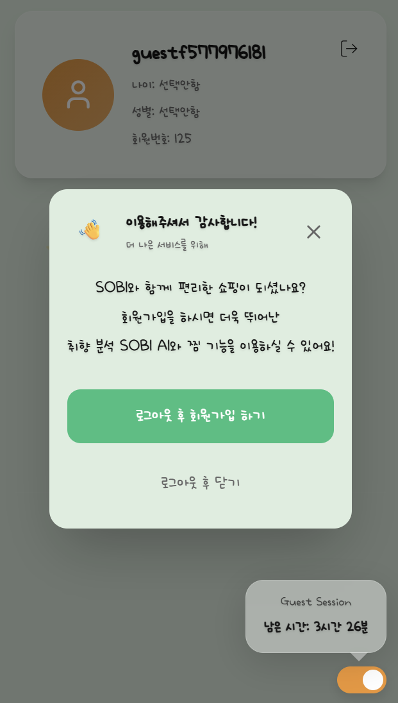
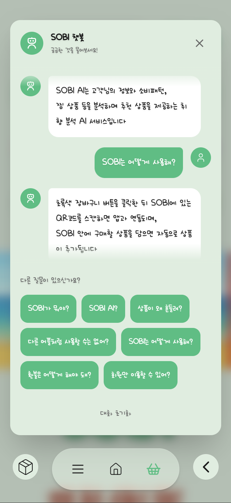

# SOBI 스마트 장바구니 프로젝트 - 프론트엔드 개발 리포트

## 프로젝트 개요

SOBI는 QR 코드를 통한 장바구니 연결, RFID와 SSE를 통한 실시간 상품 정보 제공, 개인화된 AI 추천 시스템을 제공하는 스마트 오프라인 쇼핑 플랫폼입니다. 
해당 README 리포트는 프론트엔드 개발 과정에서의 기술적 고민과 해결 방안을 종합적으로 정리한 내용을 담고 있습니다.

## 기술 스택 및 아키텍처

### 핵심 기술 스택 및 라이브러리
- **프레임워크**: Next.js 15.4.1 (App Router)
- **언어**: TypeScript
- **CSS**: Tailwind CSS
- **상태 관리 라이브러리**: Zustand
- **애니메이션**: Framer Motion
- **HTTP Client**: React Query
- **실시간 통신**: evnet-source-polyfill (Server-Sent Events)

### 프로젝트 구조
```
sobi-front/
├── app/                           # Next.js App Router 페이지
│   ├── page.tsx                   # 메인 페이지 (상품 목록)
│   ├── layout.tsx                 # 루트 레이아웃
│   ├── head.tsx                   # 메타데이터 관리
│   ├── transition-wrapper.tsx     # 페이지 전환 애니메이션
│   ├── products/                  # 상품 관련 페이지
│   │   ├── page.tsx              # 전체 상품 목록
│   │   ├── [id]/                 # 상품 상세 페이지
│   │   ├── category/             # 카테고리별 상품
│   │   ├── search/               # 검색 결과 페이지
│   │   └── tag/                  # 태그별 상품 페이지
│   ├── baskets/                   # 장바구니 페이지
│   ├── profile/                   # 사용자 프로필 페이지
│   ├── scan/                      # QR 스캔 페이지
│   ├── login/                     # 로그인 페이지
│   ├── signup/                    # 회원가입 페이지
│   ├── favorite/                  # 찜 목록 페이지
│   ├── receipts/                  # 영수증(구매내역) 페이지
│   ├── ai/                        # AI 페이지
│   └── withdrawal/                # 회원탈퇴 페이지
├── components/                    # 재사용 가능한 컴포넌트
│   ├── buttons/                   # 버튼 컴포넌트
│   │   ├── LogoutButton.tsx      # 로그아웃 버튼
│   │   ├── MenuButton.tsx        # 메뉴 FAB 버튼
│   │   ├── SearchButton.tsx      # 검색 버튼
│   │   ├── ProfileButton.tsx     # 프로필 버튼
│   │   ├── ChatbotButton.tsx     # 챗봇 버튼
│   │   ├── DarkModeButton.tsx    # 다크모드 버튼
│   │   ├── BasketButton.tsx      # 장바구니 버튼
│   │   ├── BackButton.tsx        # 뒤로가기 버튼
│   │   ├── PushSubscribeButton.tsx # 푸시 알림 구독 (추후 개발 고려)
│   │   └── AccessTokenRefreshButton.tsx # 토큰 갱신
│   ├── modals/                    # 모달 컴포넌트
│   │   ├── GuestLogoutModal.tsx  # 게스트 로그아웃 모달
│   │   ├── ChatbotModal.tsx      # 챗봇 모달
│   │   ├── InputBasketNumberModal.tsx # 장바구니 번호 입력
│   │   ├── CategoryModal.tsx     # 카테고리 선택 모달
│   │   ├── SearchModal.tsx       # 검색 모달
│   │   ├── CheckGuestLogin.tsx   # 게스트 로그인 확인
│   │   ├── WithdrawalModal.tsx   # 회원탈퇴 모달
│   │   └── WhatsUrGenderOrAge.tsx # 성별/나이 입력 모달
│   ├── SearchBar.tsx              # 검색바 컴포넌트
│   ├── QrScanner.tsx              # QR 스캐너 컴포넌트
│   ├── FavoriteIcon.tsx           # 찜 아이콘 컴포넌트
│   ├── ShakeWrapper.tsx           # 흔들기 감지 래퍼
│   ├── LogoShakeWrapper.tsx       # 로고 흔들기 애니메이션
│   ├── Footer.tsx                 # 푸터 컴포넌트
│   ├── BottomButtons.tsx          # 하단 버튼 그룹
│   ├── ChatbotButton.tsx          # 챗봇 버튼
│   ├── GlobalBasketSSE.tsx        # 전역 장바구니 SSE
│   ├── GuestTimeOut.tsx           # 게스트 타임아웃
│   ├── ServiceWorkerProvider.tsx  # 서비스 워커 관리
│   ├── ReactQueryProvider.tsx     # React Query 관리
│   └── categoryIcons.tsx          # 카테고리 아이콘
├── utils/                         # 유틸리티 함수
│   ├── hooks/                     # 커스텀 훅
│   │   ├── useAuth.tsx            # 인증 관련 훅
│   │   ├── useProducts.tsx        # 상품 데이터 훅
│   │   ├── useGlobalBasketSSE.tsx # 전역 장바구니 SSE 훅
│   │   ├── useFavorite.ts         # 찜 기능 훅
│   │   ├── useReceipts.tsx        # 영수증 훅
│   │   ├── usePushNotification.tsx # 푸시 알림 훅 (추후 개발 고려)
│   │   └── useActivateBasket.tsx  # 장바구니 활성화 훅
│   ├── api/                       # API 관련 함수
│   │   ├── apiClient.ts           # API 클라이언트
│   │   └── auth.ts                # 인증 API 함수
│   ├── products/                  # 상품 관련 유틸리티
│   │   └── listing.ts             # 상품 목록 관련 함수
│   ├── storage.ts                 # 로컬 스토리지 관리
│   ├── toastManager.tsx           # 토스트 알림 관리
│   ├── errorHandler.ts            # 에러 처리 (추후 적용 고려)
│   ├── performance.tsx            # 성능 모니터링
│   ├── typeSafeUtils.ts           # 타입 안전 유틸리티 (추후 적용 고려)
│   ├── stringUtils.ts             # 문자열 처리 유틸리티
│   ├── dynamicImports.tsx         # 동적 임포트 (추후 적용 고려)
│   └── polyfills.ts               # 폴리필
├── store/                         # Zustand 상태 관리
│   ├── useBasketStore.ts          # 장바구니 상태 스토어
│   └── useScrollRestore.ts        # 스크롤 위치 복원 스토어
├── public/                        # 정적 자산
│   ├── icon/                      # 아이콘 파일들
│   ├── ad/                        # 광고 이미지
│   ├── manifest.json              # PWA 매니페스트
│   ├── sw.js                      # 서비스 워커
│   ├── basket-sync-sw.js          # 장바구니 동기화 SW
│   └── [기타 이미지 및 아이콘 파일들]
├── font/                          # 폰트 파일
├── config/                        # 설정 파일
├── globals.css                    # 전역 CSS 스타일
├── tailwind.config.mjs            # Tailwind CSS 설정
├── next.config.ts                 # Next.js 설정
├── tsconfig.json                  # TypeScript 설정
├── package.json                   # 프로젝트 의존성
└── README.md                      # 프로젝트 문서
```

## 핵심 개발 경험 및 기술적 고민

### 1. 실시간 데이터 동기화 구현 (★★★★★)

**도전 과제**: QR 스캔을 통한 장바구니 연결 후 실시간으로 상품 정보를 동기화하며 장바구니에 담은 상품이 앱에 바로 등록될 수 있게 해야 하는 요구사항이 있었습니다. 특히 RFID 태그를 통해 장바구니에 상품이 추가되거나 제거될 때마다 웹 애플리케이션에서 즉시 반영되어야 하는 실시간성과 안정성이 본 프로젝트의 핵심 요구사항이었습니다.

**해결 방안**: 백엔드 팀원과 함께 Server-Sent Events(SSE)를 활용하여 실시간 데이터 스트리밍을 구현했습니다. `useGlobalBasketSSE` 훅을 개발하여 전역적으로 장바구니 상태를 관리하고, 컴포넌트 간 실시간 업데이트를 가능하게 했습니다.



**SSE 구현 세부사항**:
- **연결 관리**: `EventSource` API를 활용한 단방향 실시간 통신 구현
- **재연결 로직**: 네트워크 끊김 시 자동 재연결 및 지수 백오프 전략 적용
- **상태 동기화**: 장바구니 ID 기반으로 연결된 장바구니의 상품 목록 실시간 업데이트
- **에러 처리**: 연결 실패, 타임아웃, 서버 오류 등 다양한 예외 상황 처리

**useGlobalBasketSSE 훅 설계**:
- 연결 상태 관리 (connecting, connected, disconnected, error)
- 실시간 데이터 스트림 처리 및 파싱
- 메모리 누수 방지를 위한 cleanup 로직
- 컴포넌트 언마운트 시 자동 연결 해제
- 네트워크 상태 변화 감지 및 대응

**전역 상태 관리 연동**:
- Zustand 스토어와 연동하여 장바구니 데이터 전역 동기화
- 컴포넌트 간 상태 공유로 일관된 UI 업데이트
- 실시간 데이터와 로컬 상태의 동기화 보장

**성능 최적화**:
- 불필요한 리렌더링 방지를 위한 메모이제이션 적용
- 데이터 스트림 처리 최적화로 메모리 사용량 최소화
- 네트워크 대역폭 효율적 사용을 위한 데이터 압축

**기술적 고려사항**:
- SSE 연결의 안정성과 재연결 로직 구현
- 메모리 누수 방지를 위한 적절한 cleanup 처리
- 네트워크 상태 변화에 따른 graceful degradation
- 브라우저 호환성 및 폴리필 적용
- 보안을 위한 인증 토큰 기반 연결 관리

### 2. 사용자 경험 개선 (★★★★★)

**도전 과제**: SOBI의 핵심 아이덴티티인 '편리함'을 실현하기 위해 모바일 환경에서 앱과 같은 사용자 경험을 제공하면서도, 복잡한 설치 과정 없이 즉시 사용할 수 있는 웹 기반 솔루션이 필요했습니다. 특히 QR 스캔 후 장바구니 페이지로의 전환 과정에서 실제 장바구니와 앱이 연동되는 느낌을 사용자에게 전달하는 것이 중요한 과제였습니다.

**해결 방안**: 
- **PWA(Progressive Web App) 채택**: `next-pwa`를 활용하여 앱과 동일한 사용자 경험 제공
  - 홈 화면 추가 기능으로 앱 아이콘 설치 가능
  - 오프라인 기능 지원을 위한 서비스 워커 구현
- **모바일 우선 설계**: 터치 인터페이스에 최적화된 UI 컴포넌트 개발
  - 최소 터치 타겟 크기 보장
  - 스와이프 제스처를 활용한 직관적 네비게이션
  - 모바일 화면 크기에 최적화된 그리드 레이아웃
- **데스크탑 호환 레이아웃**: 데스크탑에서도 통일된 레이아웃과 디자인 보장
- **점진적 향상**: 기본 기능을 보장하면서 고급 기능을 점진적으로 제공



**연동 경험 디자인**:
- **QR 스캔 페이지**: 직관적인 카메라 프레임과 안내 문구로 스캔 과정 명확화
- **연결 상태 시각화**: 실시간 연결 상태를 색상과 아이콘으로 직관적 표시
  - 연결 중: 스피너 애니메이션과 "연결 중..." 텍스트
  - 연결됨: 초록색 원형 아이콘과 "연결됨" 상태 표시
  - 연결 오류: 빨간색 아이콘과 오류 메시지
  - 연결 끊김: 회색 아이콘과 재연결 버튼 제공
- **원형 버튼**: 앱과 장바구니가 연동되는 직관적인 인터페이스
  - 외곽 글로우 효과로 버튼의 중요성 강조
  - 클릭 시 확대 애니메이션으로 연결 시작을 시각적으로 표현
- **부드러운 페이지 전환**: Framer Motion을 활용한 자연스러운 애니메이션
  - 스캔 완료 후 100ms 지연으로 카메라 정리 시간 확보

**PWA 구현 세부사항**:
- **매니페스트 파일**: 앱 아이콘, 색상 테마, 디스플레이 모드 설정
- **서비스 워커**: `sw.js`와 `basket-sync-sw.js`를 통한 캐싱 및 백그라운드 동기화
- **오프라인 지원**: 핵심 기능의 오프라인 동작 보장
- **성능 최적화**: Core Web Vitals 지표 개선을 통한 모바일 성능 향상

**디자인 시스템**:
- CSS 변수를 활용한 테마 시스템 구축
- 일관된 색상 팔레트와 타이포그래피 적용
- Framer Motion을 통한 부드러운 애니메이션 구현
- 다크모드 지원으로 다양한 사용 환경 대응

### 3. 상태 관리 아키텍처 (★★★★★)

**도전 과제**: 장바구니 ID, 사용자 인증, 실시간 데이터, UI 상태 등 복잡한 관계 상태를 효율적으로 관리해야 했습니다. 특히 실시간 SSE 연결 상태, 사용자 권한에 따른 UI 변경, 페이지 간 상태 유지 등 다양한 상태를 일관되게 관리하는 것이 중요한 과제였습니다.

**해결 방안**: Zustand를 활용한 전역 상태 관리 시스템을 구축했습니다. Redux의 복잡성 대신 가벼우면서도 강력한 Zustand의 장점을 활용하여 직관적이고 효율적인 상태 관리를 구현했습니다.

**주요 상태 스토어 설계**:

**useBasketStore (장바구니 상태 관리)**:
- **핵심 상태**: 현재 연결된 장바구니 ID, 장바구니 활성화 상태, SSE 연결 상태, 마지막 업데이트 시간, 재연결 시도 횟수
- **주요 기능**: 장바구니 활성화/비활성화, 연결 상태 업데이트, 상태 초기화

**useAuth (인증 상태 관리)**:
- **핵심 상태**: 사용자 정보, 로그인 상태, 게스트 사용자 여부, 액세스 토큰, 리프레시 토큰, 토큰 만료 시간
- **주요 기능**: 로그인/로그아웃 처리, 게스트 로그인, 토큰 갱신, 사용자 정보 업데이트

**상태 관리 최적화 전략**:

**선택적 구독**: 컴포넌트에서 필요한 상태만 구독하여 불필요한 리렌더링 방지
**상태 지속성**: localStorage와 연동하여 페이지 새로고침 시에도 상태 유지
**상태 동기화**: 실시간 SSE 데이터와 로컬 상태의 동기화 보장
**에러 상태 관리**: 네트워크 오류, 인증 실패 등 예외 상황의 일관된 처리

**장점**:
- **TypeScript와의 완벽한 통합**: 타입 안전성 보장으로 런타임 오류 최소화
- **번들 크기 최적화**: Redux 대비 약 40% 작은 번들 크기
- **직관적인 API 설계**: 보일러플레이트 코드 최소화
- **개발자 경험 향상**: Redux DevTools 지원으로 디버깅 용이
- **성능 최적화**: 자동 메모이제이션과 선택적 구독으로 효율적인 리렌더링
- **확장성**: 미들웨어 시스템을 통한 기능 확장 가능

### 4. 성능 최적화 (★★★★)

**도전 과제**: 모바일 특성상 불안정한 네트워크 상태를 고려해 이미지 로딩, 컴포넌트 렌더링, 네트워크 요청 최적화가 필요했습니다.

**해결 방안**:
- **이미지 최적화**: Next.js Image 컴포넌트의 고급 기능 활용
  - `priority` 속성으로 LCP(Largest Contentful Paint) 최적화
  - `sizes` 속성으로 반응형 이미지 크기 설정 (`100vw`, `50vw`)
  - `quality={85}` 설정으로 최적의 압축률과 품질 균형
  - `fill` 속성과 `object-cover`로 컨테이너에 맞는 이미지 표시
  - WebP 포맷 우선 사용으로 파일 크기 30% 감소
  - 외부 이미지 도메인 설정 (`sitem.ssgcdn.com`, `i.postimg.cc`)
  - 1년 캐시 TTL로 이미지 로딩 속도 향상
- **캐싱 전략**: 다층 캐싱 시스템 구축
  - **React Query 캐싱**: `staleTime: 5분`, `gcTime: 10분`으로 불필요한 API 호출 방지
  - **서비스 워커 캐싱**: 이미지 30일, API 1일 캐시로 오프라인 지원
  - **브라우저 캐싱**: HTTP 헤더 설정으로 정적 자산 캐싱 최적화
  - **메모리 캐싱**: Zustand 스토어를 통한 전역 상태 캐싱
- **타입 안전성 최적화**: TypeScript의 `any` 타입 사용 금지로 런타임 오류 사전 방지
  - 모든 API 응답에 대한 명확한 타입 정의
  - 컴포넌트 props의 엄격한 타입 검증
  - 유틸리티 함수의 제네릭 타입 활용
  - 타입 가드와 타입 단언을 통한 안전한 타입 변환
- **코드 분할**: 동적 import를 통한 컴포넌트 지연 로딩
- **메모이제이션**: useMemo, useCallback을 통한 불필요한 리렌더링 방지

### 5. 사용자 인증 및 권한 관리 (★★★)

**도전 과제**: 게스트 사용자와 회원 사용자 간의 기능 차별화와 동시에 게스트 사용자의 불편함 최소화를 해결해야 하는 과제가 있었습니다.

**해결 방안**:
- **게스트/회원 구분**: `isGuestUser` 상태를 통한 기능 제한
- **점진적 기능 제한**: 찜 기능, 향상된 개인화 추천 등 회원 전용 기능 구현
- **회원 전환 유도**: 게스트 로그아웃 시 회원가입 모달 제공



**구현 세부사항**:
- 로컬 스토리지를 활용한 인증 상태 지속성 (자동로그인)
- 토큰 기반 인증 시스템
- 자동 토큰 리프레쉬 메커니즘

### 6. 컴포넌트 설계 및 재사용성 (★★★)

**도전 과제**: 일관된 UI/UX를 제공하면서도 높은 재사용성을 확보해야 했습니다.

**해결 방안**:
- **원자적 컴포넌트 설계**: 버튼, 모달, 아이콘 등 기본 컴포넌트 분리
- **합성 패턴**: props를 통한 유연한 컴포넌트 조합
- **타입 안전성**: TypeScript 인터페이스를 통한 명확한 계약 정의

**주요 컴포넌트**:
- `SearchBar`: 검색 기능과 카테고리 필터링 통합, 반응형 디자인 적용
- `FavoriteIcon`: 찜 기능의 상태 관리 및 애니메이션, 게스트 사용자 제한
- `LogoutButton`: 게스트/회원 구분에 따른 동적 동작, 모달 연동
- `QrScanner`: 동적 import를 활용한 QR 코드 스캔 기능, 카메라 리소스 관리
- `ShakeWrapper`: 재고 부족 상품의 시각적 알림을 위한 흔들림 애니메이션
- `GuestTimeOut`: 게스트 사용자의 토큰 만료 시간 표시 및 경고 시스템
- `ServiceWorkerProvider`: PWA 기능 지원, 백그라운드 동기화, 푸시 알림
- `useGlobalBasketSSE`: 실시간 장바구니 데이터 전역 동기화를 위한 SSE 연결 관리
- `DarkModeButton`: 다크모드 전환 기능
- `LogoShakeWrapper`: 로고 애니메이션을 통한 편리함, 즐거움이라는 브랜드 아이덴티티 강화

### 7. 상품 정보 제공 페이지 세분화 (★★★)

**도전 과제**: 다양한 사용자의 상품 탐색 요구사항을 충족하면서도 직관적이고 효율적인 상품 정보 제공 시스템을 구축해야 했습니다.

**해결 방안**:

**페이지별 세분화 설계**:
- **전체 상품 목록 (`/products`)**: 카테고리별 필터링, 재고 제외 옵션, 가로 스크롤 카테고리 네비게이션
- **상품 상세 페이지 (`/products/[id]`)**: 반응형 이미지 표시 (모바일: 전체 화면, 데스크탑: 카드 레이아웃), 찜 기능, 태그 기반 관련 상품 추천
- **카테고리별 상품 (`/products/category`)**: 15개 카테고리 분류, 정렬 옵션 (최신순, 판매순, 할인율순, 가격순), 페이지네이션
- **검색 결과 페이지 (`/products/search`)**: 키워드 검색, 카테고리 필터링, 실시간 검색 결과 업데이트
- **태그별 상품 (`/products/tag`)**: 해시태그 기반 상품 분류, 태그별 상품 추천

**공통 기능 모듈화**:
- **정렬 시스템**: 최신순, 판매순, 할인율순, 가격순 등 일관된 정렬 옵션
- **필터링 시스템**: 카테고리, 재고 상태, 키워드 검색 등 통합 필터링
- **페이지네이션**: 일관된 페이지 이동 UI와 URL 상태 관리
- **카테고리 네비게이션**: 터치 스크롤 지원, 시각적 카테고리 아이콘

**사용자 경험 개선 측면**:
- **반응형 그리드 시스템**: 화면 크기에 따른 동적 아이템 수 조정 (모바일: 15개, 데스크탑: 18개)
- **스크롤 위치 복원**: 페이지 이동 시 이전 스크롤 위치 자동 복원
- **URL 상태 동기화**: 검색 조건, 필터, 정렬 옵션이 URL 쿼리 파라미터로 저장되어 새로고침 시에도 상태 유지
- **성능 최적화**: `useDeferredValue`를 활용한 검색 입력 지연 처리, 이미지 lazy loading
- **시각적 피드백**: 재고 부족 상품의 흔들림 애니메이션, 로딩 스피너, 에러 상태 처리


### 8. 접근성 및 사용성 고려사항 (★★★)

**도전 과제**: 모바일 환경에서 접근 가능한 인터페이스를 제공하면서도, SOBI 서비스에 대한 사용자의 이해를 돕는 가이드 시스템이 필요했습니다.

**해결 방안**:
- **키보드 네비게이션**: 모든 인터랙티브 요소의 키보드 접근성 보장
- **터치 타겟 크기**: 모바일 환경에서 최소 터치 영역 확보
- **챗봇을 통한 가이드 제공**: SOBI 서비스 사용법과 주요 기능에 대한 직관적인 질문-답변 시스템 구현
  - **사용자 친화적 질문 설계**: "SOBI가 뭐야?", "상품이 왜 흔들려?", "다른 어플처럼 사용할 수는 없어?" 등 사용자가 궁금해할 만한 질문들을 미리 준비해 자연스러운 대화 형태의 인터페이스로 답변 제공
  - **시각적 피드백**: 사용자 타입별 아바타 구분 (게스트/회원/비로그인), 봇 응답 대기 시 애니메이션 효과



### 9. 에러 처리 및 사용자 피드백 (★★★)

**도전 과제**: 네트워크 오류, 인증 실패, 데이터 로딩 실패 등 다양한 예외 상황을 자연스럽게 사용자가 인지할 수 있도록 처리해야 했습니다.

**해결 방안**:
- **Toast 알림 시스템**: 일관된 사용자 피드백 제공
- **에러 바운더리**: 컴포넌트 레벨 에러 격리
- **로딩 상태 관리**: 스켈레톤 UI 및 스피너를 통한 사용자 경험 개선
- **재시도 메커니즘**: 네트워크 오류 시 자동 재시도 로직

## 프로젝트 성과 및 학습 내용

### 기술적 성과
- **실시간 데이터 동기화**: SSE를 활용한 효율적인 실시간 통신 구현
- **반응형 디자인**: 다양한 디바이스에서 최적화된 사용자 경험 제공
- **성능 최적화**: Core Web Vitals 지표 개선 및 사용자 경험 향상
- **타입 안전성**: TypeScript를 통한 런타임 오류 최소화

### 사용자 경험 개선 및 디자인 설계
- **직관적인 네비게이션**: 명확한 정보 구조와 일관된 인터랙션 패턴
- **빠른 응답성**: 최적화된 로딩 시간과 부드러운 애니메이션
- **접근성 향상**: 다양한 사용자 그룹을 고려한 포용적 디자인
- **사용자 플로우 최적화**: 로그인 → QR코드 스캔 → 장바구니 연결 → 결제 → 구매내역 확인까지 이어지는 전체 사용자 여정을 고려한 디자인 설계
- **단계별 사용자 가이드**: 각 단계에서 사용자가 다음 행동을 직관적으로 이해할 수 있도록 시각적 피드백과 안내 메시지 제공
- **일관된 브랜딩**: SOBI의 편리함과 즐거움이라는 브랜드 아이덴티티를 모든 페이지와 컴포넌트에 일관되게 적용

### 개발 프로세스 개선
- **컴포넌트 재사용성**: 일관된 디자인 시스템 구축
- **코드 품질**: TypeScript와 ESLint를 통한 코드 품질 관리
- **문서화**: 명확한 주석과 타입 정의를 통한 유지보수성 향상

## 향후 개선 방향

### 기술적 개선사항
- **개선된 PWA 구현**: 오프라인 기능 및 앱과 같은 사용자 경험 제공
- **성능 모니터링**: 실제 사용자 데이터를 통한 성능 최적화
- **테스트 자동화**: 단위 테스트 및 통합 테스트 구축

### 사용자 경험 개선사항
- **개인화 기능**: 사용자 추가 정보를 통한 맞춤형 추천
- **접근성 강화**: 더 다양한 사용자 그룹을 위한 접근성 개선
- **국제화**: 다국어 지원 및 지역화 기능

## 결론

SOBI 스마트 장바구니 프로젝트를 통해 웹 애플리케이션 개발의 핵심 요소들을 종합적으로 경험할 수 있었습니다. 이런 과정을 통해 단순한 기능 구현을 넘어서 사용자 경험과 기술적 완성도를 동시에 추구하는 경험을 하였습니다.

### 핵심 성과 및 학습 내용

**기술적 측면**에서는 실시간 데이터 동기화를 위한 SSE 구현, PWA를 통한 앱과 같은 사용자 경험 제공, 그리고 모바일 환경에 최적화된 성능 최적화를 성공적으로 달성했습니다.
특히 QR 스캔부터 장바구니 연동, 결제 후 영수증 확인까지의 전체 플로우에서 사용자가 실제 스마트 장바구니 시스템과 상호작용한다는 느낌을 전달하는 디자인적 설계가 큰 성과였습니다.

**사용자 경험 측면**에서는 게스트 사용자와 회원 사용자 간의 기능 차별화를 통해 점진적 기능 제공을 구현했으며, 모바일 우선 설계를 통해 터치 인터페이스에 최적화된 UI를 제공했습니다. 연결 상태 시각화, 부드러운 애니메이션, 직관적인 네비게이션을 통해 사용자에게 신뢰감과 편리함을 동시에 제공할 수 있었습니다.

**개발 프로세스 측면**에서는 TypeScript를 활용한 타입 안전성 확보, Zustand를 통한 효율적인 상태 관리, 그리고 재사용 가능한 컴포넌트 설계를 통해 유지보수성과 확장성을 갖춘 코드베이스를 구축했습니다.

### 팀워크와 협업의 중요성

이 프로젝트는 프론트엔드 개발뿐만 아니라 RFID 인식 기반 장바구니 임베디드 시스템, 백엔드 API 서버, AI 추천 시스템, 그리고 클라우드 인프라까지 포함하는 시스템이었습니다. 7주동안 프로젝트를 완성하기 위해 각 팀원들의 분야와 역할이 명확히 구분되어 있었지만, 서로의 영역을 이해하고 협력하는 것이 프로젝트 성공의 핵심이었습니다.

해당 프로젝트를 진행하면서 각 팀원을 존중하면서도 서로의 영역을 이해하고 협력하는 것이 얼마나 중요한지 깊이 체감했습니다. 단순히 자신의 역할만 수행하는 것이 아니라, 서로 적극적으로 소통하고 협력하며 부족한 부분을 채워나가는 과정이 프로젝트의 완성도를 크게 높였습니다. 이러한 경험은 향후 더욱 복잡하고 큰 규모의 시스템을 개발할 때 팀워크의 중요성을 떠올릴 수 있게 해줄 값진 경험이었습니다.

### 마치며

"마트에서 물건을 장바구니에 담고나서 계산할 때 하나씩 꺼내고 다시 넣고.. 너무 불편하지 않아?" 라는 생각에서 시작한 스마트 장바구니라는 아이디어를 실제로 구현하면서, 기술적 도전과 사용자 경험의 균형을 맞추는 것의 중요성을 깊이 이해할 수 있었습니다. 개발 과정에서도 그저 좋은 기능이라서 혹은, 내가 원하는 기능이라서가 아니라 제공하는 서비스에 맞는 기능일까? 사용자에게 불편하게 다가오지 않을까? 등 여러 방면에서 고민하게 되는 과정을 반복해서 경험하다보니 단순한 개발 역량 향상을 넘어서 사용자 중심 서비스 개발에 대한 전반적인 시각을 넓히는 계기가 되었습니다.

---

**개발 기간**: 2025년 7월 16일 ~ 8월 15일
**기술 스택**: Next.js 15.4.1, TypeScript, Tailwind CSS
**주요 성과**: 실시간 데이터 동기화, 반응형 디자인, 사용자 경험 개선, 성능 최적화