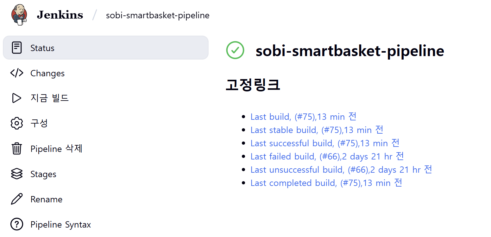
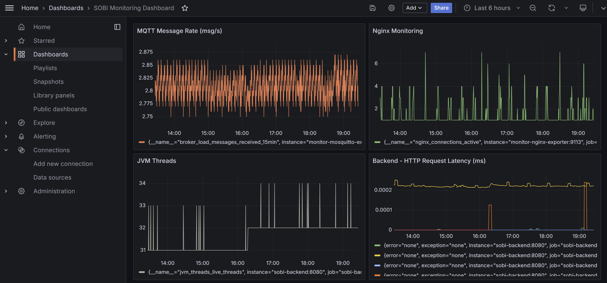

# AIoT 스마트바스켓 EC2 인프라 구조

## 서버 구성 개요

| 항목 | 내용 |
|------|------|
| 서버 | AWS EC2 |
| 운영체제 | Ubuntu 22.04 |
| 접속 방식 | SSH 접속 (공유 PEM 키) |
| 주요 작업 | Docker 실행, Git 커밋, 서비스 운영 |

---

## Docker 환경

- EC2에 Docker 및 Docker Compose 설치 완료
- 각 계정에서 `sudo` 없이 Docker 사용 가능하도록 `docker` 그룹 권한 부여

```bash
sudo usermod -aG docker [계정명]
```

- 모든 서비스는 Docker Compose 기반으로 컨테이너화되어 관리됨
- Git 변경 사항은 Jenkins를 통해 자동으로 반영되어 최신 컨테이너가 실행됨

---

## 계정 구조 및 작업 방식

| 항목 | 내용 |
|------|------|
| 계정 관리 목적 | Git 커밋 작성자 구분용 계정 분리 |
| 계정별 Git 설정 | 각자 `git config --global` 로 이름/이메일 다르게 설정 |
| SSH 접속 방식 | 동일한 PEM 키 사용, 계정명으로 구분하여 접속 |
| 접속 예시 | `ssh -i 키.pem [계정명]@서버주소` |

---

## 디렉토리 구조

| 경로 | 설명 |
|------|------|
| /home/[계정명]/ | 각자 홈 디렉토리 |
| /home/[계정명]/S13P11B103 | 프로젝트 폴더 (공통) |
| /home/[계정명]/.vscode-server/ | VSCode Remote-SSH 서버 설치 경로 |

---

## CI/CD 파이프라인 (Jenkins)

- Jenkins는 Docker 컨테이너로 운영되며, `docker-compose.jenkins.yaml`을 통해 관리
- GitLab Webhook과 연동되어, **Merge Request가 승인되면 자동으로 빌드 및 배포 진행**
- 파이프라인 개요:
  1. 기존 웹 서비스 컨테이너 중지 및 제거
  2. 최신 소스 기반으로 Docker 이미지 빌드
  3. `docker-compose.web.yaml`을 이용해 서비스 재배포
- Jenkins Pipeline은 GitLab의 특정 브랜치(MR 대상)만 대상으로 설정되어 있어 불필요한 배포 방지 가능

### Jenkins 파이프라인 상태 화면 (예시)

---

## 웹 서비스 구조 (Nginx + 도메인 연결)

- `docker-compose.web.yaml`에는 React 프론트엔드, Spring Boot 백엔드, 그리고 Nginx가 포함됨
- Nginx는 **Reverse Proxy** 역할을 하며 다음 기능을 수행함:
  - 프론트/백엔드 요청을 URI에 따라 적절한 컨테이너로 라우팅
  - 80 → 443 리디렉션 (HTTPS 강제)
  - `sobi-basket.app` 및 `www.sobi-basket.app` 도메인 처리
  - Let’s Encrypt를 통한 **무료 SSL 인증서 자동 적용**
- 실제 사용자 접근은 Nginx를 통해 이루어짐

---

## 모니터링 (Prometheus + Grafana)

- `docker-compose.monitoring.yaml` 파일을 통해 Prometheus, Grafana, 각종 Exporter 컨테이너 실행
- **Prometheus**:
  - Docker, EC2, Mosquitto, Jenkins 등에서 메트릭 수집
  - Exporter를 통해 각 서비스 메트릭 EndPoint 연결 (`/metrics`)
- **Grafana**:
  - Prometheus 데이터를 기반으로 시각화 대시보드 구성
  - 다음 정보 시각화 가능:
    - EC2 CPU, 메모리 사용률
    - Docker 컨테이너 상태
    - Jenkins 빌드 현황
    - Kafka / Redis / PostgreSQL 메트릭 (확장 가능)
- 대시보드는 팀원이 공유 가능한 형태로 구성되어 있음

### Grafana 대시보드 (예시)

아래는 실제 운영 중인 Sobi Monitoring Dashboard의 예시입니다.

- MQTT 메시지 수신률
- Nginx 연결 수
- 백엔드 JVM 스레드 수
- 백엔드 HTTP 응답 지연시간(ms)



---

## Docker Compose 구성 분리

- 기능별 Docker Compose 파일을 분리하여 유지보수성과 가독성 향상
- 각 Compose 파일은 독립적으로 `-f` 옵션을 통해 실행 가능

| 파일명 | 설명 |
|--------|------|
| `docker-compose.core.yaml` | 핵심 인프라 (PostgreSQL, Redis 등) |
| `docker-compose.jenkins.yaml` | CI/CD용 Jenkins 서비스 구성 |
| `docker-compose.monitoring.yaml` | Prometheus, Grafana, Exporter 구성 |
| `docker-compose.web.yaml` | 웹 서비스용 프론트엔드, 백엔드, Nginx 포함 (Jenkins에 의해 자동 실행)

> 예시 실행 명령어:

```bash
docker compose -f docker-compose.core.yaml up -d
docker compose -f docker-compose.jenkins.yaml up -d
docker compose -f docker-compose.monitoring.yaml up -d
# docker-compose.web.yaml은 Jenkins가 GitLab의 master 브랜치에 Merge Request가 Accepted 되었을 때 자동 실행
```

---

## 보안 및 운영 관리

| 항목 | 설명 |
|------|------|
| 비밀번호 로그인 | 비활성화 (오직 PEM 키로만 접속 가능) |
| `.vscode-server` 캐시 | 계정별로 격리되어 충돌 없음 |
| `.ssh/config` | 각자 로컬에서 관리하며, 리포지토리에 포함하지 않음 |
| Docker 실행 | 모든 계정에서 `sudo` 없이 실행 가능 |
| `.env`, `.pem` 파일 | 절대 공개 금지, Git 관리 대상 제외 |

---

## 요약

- 본 인프라는 **EC2 기반 Docker Compose 아키텍처**로 구성됨
- **멀티 계정**으로 Git 커밋 이력 분리 및 팀 협업 가능
- **Jenkins + GitLab Webhook** 기반의 자동화된 CI/CD 파이프라인 운영
- **도메인 + Nginx + SSL 인증**으로 서비스 접근성 확보
- **Prometheus + Grafana**를 통한 인프라 메트릭 실시간 모니터링 가능
- Compose 파일 분리를 통해 **유지보수성 및 명확한 책임 분리 확보**

---
